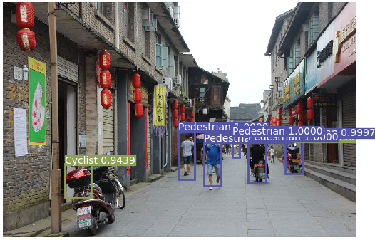
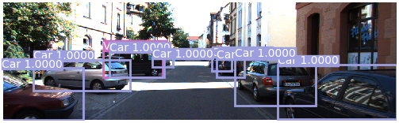
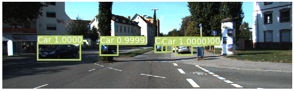

# PyTorch-YOLOv3-Kitti
 YOLOv3-PyTorch 在 Kitti 数据集上训练


#### 本仓库 forked from [eriklindernoren](https://github.com/eriklindernoren/PyTorch-YOLOv3)

## 安装
```bash
$ git clone https://github.com/packyan/PyTorch-YOLOv3-kitti.git
$ cd PyTorch-YOLOv3-kitti/
$ sudo pip3 install -r requirements.txt
```


## 下载预训练权值
如果你想用经过darknet-53 在 IMAGENET上预训练过的权值, 请从 [darknet53.conv.74](https://pjreddie.com/media/files/darknet53.conv.74)下载,放到`checkpoints/`文件夹下

如果你想用经过darknet-53 在 KITTI上预训练过的权值, 用作检测或训练，请从[pretrained weights file](https://drive.google.com/file/d/1BRJDDCMRXdQdQs6-x-3PmlzcEuT9wxJV/view?usp=sharing), 将它放到 `weights` 目录下, the path:
`weights/yolov3-kitti.weights`

## 下载KITTI数据集

[The KITTI Vision Benchmark Suite](http://www.cvlibs.net/datasets/kitti/eval_object.php)

将你下载的KITTI数据集转换成COCO数据集格式：请参考 [label_transform](label_transform/README.md)

## 推理Inference
使用预训练过的权值进行预测。 weights/yolov3-kitti.weights 已经在KITTI数据集上训练过。
`python3 detect.py --image_folder /data/samples`

<p align="center"></p>
<p align="center"></p>
<p align="center"></p>
<p align="center"></p>

小目标检测

<p align="center"></p>

## 检测

run`detect.py` to detect objects, and please  put samples into `data/samples`
defult weights files is `weights/kitti.weights`

## Video

run `video.py` to detect objects from a webcam or a video file.
On I7 7700 8G GTX1070 FPS is 22 cause some problems, test resized images is really faster than resizeing images and then inference.
## Test

run `test.py`

## 训练
Please run `python3 -m visdom.server` first to vislizer your training loss.

Data augmentation as well as additional training tricks remains to be implemented. PRs are welcomed!
```
    train.py [-h] [--epochs EPOCHS] [--image_folder IMAGE_FOLDER]
                [--batch_size BATCH_SIZE]
                [--model_config_path MODEL_CONFIG_PATH]
                [--data_config_path DATA_CONFIG_PATH]
                [--weights_path WEIGHTS_PATH] [--class_path CLASS_PATH]
                [--conf_thres CONF_THRES] [--nms_thres NMS_THRES]
                [--n_cpu N_CPU] [--img_size IMG_SIZE]
                [--checkpoint_interval CHECKPOINT_INTERVAL]
                [--checkpoint_dir CHECKPOINT_DIR]
```
- 训练之前首先把数据集转换成COCO格式，请参考 [label_transform](label_transform/README.md)
- 修改`datasets.py`中`ListDataset`的`labels_coco_type_path` 变量，变量值为将KITTI转换成COCO数据集格式的label文件夹


## Paper

### YOLOv3: An Incremental Improvement
_Joseph Redmon, Ali Farhadi_ <br>

**Abstract** <br>
We present some updates to YOLO! We made a bunch
of little design changes to make it better. We also trained
this new network that’s pretty swell. It’s a little bigger than
last time but more accurate. It’s still fast though, don’t
worry. At 320 × 320 YOLOv3 runs in 22 ms at 28.2 mAP,
as accurate as SSD but three times faster. When we look
at the old .5 IOU mAP detection metric YOLOv3 is quite
good. It achieves 57.9 AP50 in 51 ms on a Titan X, compared
to 57.5 AP50 in 198 ms by RetinaNet, similar performance
but 3.8× faster. As always, all the code is online at
https://pjreddie.com/yolo/.

[[Paper]](https://pjreddie.com/media/files/papers/YOLOv3.pdf) [[Original Implementation]](https://github.com/pjreddie/darknet)


## Credit
```
@article{yolov3,
  title={YOLOv3: An Incremental Improvement},
  author={Redmon, Joseph and Farhadi, Ali},
  journal = {arXiv},
  year={2018}
}
```

## 注意点：

- 将pycharm的工作目录转换成项目根目录